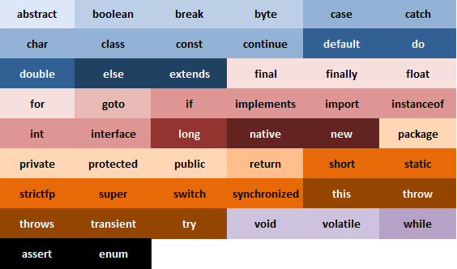
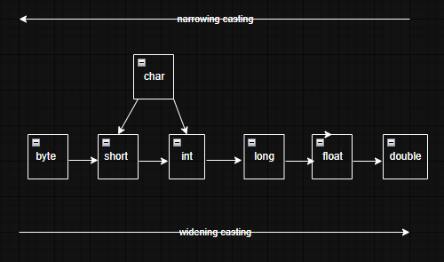

# ♨️ Fundamentos
## Propriedades
A linguagem de programação Java é uma linguagem <ins>compilada</ins> e <ins>case sensitive</ins>, isto é existe diferenciação entre letra maiúscula e minúscula.
## Compilação e execução
### Compilação
Compila o código-fonte e cria o arquivo bytecode (é um código intermediário gerado pela JVM - Java Virtual Machine).

```
javac nome_arquivo.java
```

### Execução
Para execução de um programa java pelo terminal podemos utilizar duas variações dependendo da versão.

```
java nome_arquivo
java nome_arquivo.java 
```

> [!NOTE]
> A partir do Java 11, é possível executar um programa Java sem o arquivo de compilação.
> As variáveis não podem ser declaradas iniciantes com símbolos ou números

> [!TIP]
> Comentários são ignorados pelo compilador, logo não muda o comportamento do programa, possui dois tipos:

|    Linha      |      Bloco       |
|---------------|------------------|
| // comentário | /* comentario */ |

## Convenções de código (Padrões e boas práticas de código)
> [!TIP]
> **LowerCase:** Utilizar em declaração de variáveis.
> **CamelCase:** utilizada para nomear classes.
> Evitar de utilizar comentários com explicação óbvia.

## Palavras reservadas
São palavras chaves da linguagem que possuem uma semântica(significado) e não podem ser utilizadas como nomes de <ins>variáveis, classes e etc.</ins> <br/> <br/>



## Operadores aritméticos
Servem para realizar operações artiméticas entre os tipos de dados numéricos.

| Símbolo |          Descrição         |
|---------|----------------------------|
|    +    |           Adição           |
|    -    |          Subtração         |
|    *    |        Multiplicação       |
|    /    |           Divisão          |
|    %    |  Resto da divisão (módulo) |

### Abreviações de operadores aritméticos

| Símbolo |          Descrição           |
|---------|------------------------------|
|   +=    |Incrementa o valor da variável|
|   -=    |Decrementa o valor da variável|
|   *=    |              --              |
|   /=    |              --              |
|   ++    |   Incrementa 1 na variável   |
|   --    |   Decrementa 1 na variável   |

> [!TIP]
> **Pré-fixada**: Incrementa e após isso realiza a attribuição. <br/>
> <ins>Exemplo:</ins> ++vendas <br/>
> **Pós-fixada**: Atribui e depois incrementa o valor. <br/>
> <ins>Exemplo:</ins> vendas++

## Tipos primitivos
Tipos de variáveis básicas e cada uma possui uma capacidade e valores que podem receber. <br/>

|   Tipo     |              Descrição                |
|------------|---------------------------------------|
|  boolean   | Recebe valores true ou false          |
|    byte    |      Inteiro de 8 bits                |
|    char    | Caractere, valor em àspas simples     |
|   double   | Ponto flutuante, precisão dupla (2d)  |
|   float    | Ponto flutuante, precisão simples (2f)|
|    int     |              inteiro                  |
| long/short |       inteiro longo/curto (1L)        |


> [!IMPORTANT]
> O tipo <ins>float</ins> e <ins>double</ins> não devem ser utilizados para valores financeiros, pois perderia a precisão requerida, logo usa outro tipo conhecido como <ins>BigDecimal</ins>. <br/>

## Casting
O Casting permite converter um tipo de dado para outro. Normalmente é feito do tipo menor para o maior, pois na forma invertida pode gerar perca de informações (do maior para o menor) <br/>


### Promoção Aritmética
Operações com tipos diferentes, o resultado será sempre do tipo maior. <br/>
**Exemplo:** double com float, o float se mantém.

## Entrada e saída de dados

## Escape